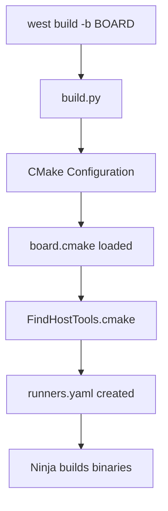

<div dir="rtl" style="text-align: right;">

# יומן שינויים (Changelog)

---

## 2026-01-05

### סיכום כללי

יום זה הוקדש ללמידה מעמיקה והבנה של מערכת ה-Build וה-Flash של **Zephyr RTOS**, בדגש על לוחות TI ובפרט על לוח **LP-EM-CC2745R10-Q1**. נוצרו מספר דוחות תיעודיים ובוצע שינוי משמעותי בקובץ התצורה של הלוח.

---

### שינויים בקוד

#### 1. עדכון `board.cmake` עבור לוח TI LP-EM-CC2745R10-Q1

**קובץ:** [`boards/ti/lp_em_cc2745r10_q1/board.cmake`](file:///Users/tzoharlary/zephyrproject/zephyr/boards/ti/lp_em_cc2745r10_q1/board.cmake)

**תיאור השינוי:**  
נוספה תמיכה גמישה יותר במיקום ה-OpenOCD של TI. במקום לדרוש מפורשות משתנה סביבה `TI_OPENOCD_INSTALL_DIR`, הוספה תמיכה ב-fallback אוטומטי:

```cmake
# TI OpenOCD Path Configuration
# Two methods are supported:
#   1. Environment Variable: Set TI_OPENOCD_INSTALL_DIR
#   2. Default Location (Fallback): ${ZEPHYR_BASE}/../ti-openocd

if(DEFINED ENV{TI_OPENOCD_INSTALL_DIR})
  set(TI_OPENOCD_ROOT $ENV{TI_OPENOCD_INSTALL_DIR})
else()
  get_filename_component(TI_OPENOCD_ROOT "${ZEPHYR_BASE}/../ti-openocd" ABSOLUTE)
endif()

set(OPENOCD ${TI_OPENOCD_ROOT}/bin/openocd)
set(OPENOCD_DEFAULT_PATH ${TI_OPENOCD_ROOT}/share/openocd/scripts)
```

> [!IMPORTANT]
> שינוי זה מאפשר לעבוד עם TI OpenOCD ללא צורך בהגדרת משתנה סביבה, כאשר הכלי ממוקם בתיקיית `ti-openocd` לצד תיקיית `zephyr`.

---

### דוחות ותיעוד שנוצרו

| קובץ | תיאור |
|------|-------|
| [`reports/build-and-flash/west_build_flash_openocd_report.md`](reports/build-and-flash/west_build_flash_openocd_report.md) | דוח מפורט על מנגנון `west build` ו-`west flash` עם OpenOCD |
| [`reports/test-automation/west_twister_report.md`](reports/test-automation/west_twister_report.md) | דוח על שימוש ב-`west twister` לבדיקות |

---

### תובנות עיקריות שהושגו במהלך היום

#### 1. הבנת מבנה ה-Build של Zephyr



- **נקודת כניסה:** הפקודה `west build` מופעלת דרך הקובץ `scripts/west_commands/build.py`.
- **תהליך:** CMake קורא את `board.cmake` של הלוח הספציפי, מחפש כלים כמו OpenOCD, ויוצר קובץ `runners.yaml`.

#### 2. כיצד West מוצא את OpenOCD

שרשרת העדיפות לחיפוש OpenOCD:

1. **משתנה סביבה** - `TI_OPENOCD_INSTALL_DIR`
2. **הגדרה ב-`board.cmake`** - משתנים `OPENOCD` ו-`OPENOCD_DEFAULT_PATH`
3. **חיפוש אוטומטי ב-PATH** - דרך `find_program(OPENOCD openocd)` ב-`FindHostTools.cmake`

#### 3. מבנה ה-Flash עם OpenOCD

- הפקודה `west flash` קוראת את הקובץ `build/zephyr/runners.yaml` שנוצר בתהליך ה-build.
- ה-Runner `openocd.py` בונה את פקודת ה-OpenOCD המלאה כולל נתיב הקונפיגורציה והפקודות.

#### 4. שימוש ב-Twister לבדיקות

- **Twister** הוא כלי בדיקות אוטומטי של Zephyr.
- ניתן להפעיל באמצעות `west twister` או ישירות דרך `./scripts/twister`.
- לבניית בדיקות עבור לוח CC2745R10-Q1:

```bash
west twister -p lp_em_cc2745r10_q1/cc2745r10_q1 \
    -T tests/bluetooth/tester \
    --build-only
```

#### 5. מבנה קבצי הלוח בפרויקט

```
boards/ti/lp_em_cc2745r10_q1/
├── board.cmake                          # הגדרות runners (J-Link, OpenOCD)
├── board.yml                            # מטא-דאטא על הלוח
├── lp_em_cc2745r10_q1_cc2745r10_q1.dts  # Device Tree
├── lp_em_cc2745r10_q1_cc2745r10_q1.yaml # הגדרות פלטפורמה
├── lp_em_cc2745r10_q1_cc2745r10_q1_defconfig # Kconfig defaults
├── Kconfig                              # אפשרויות קונפיגורציה
└── boosterpack_connector.dtsi           # Device Tree Include
```

#### 6. הבדלים בין J-Link ל-OpenOCD

| פרמטר | J-Link | OpenOCD |
|-------|--------|---------|
| **הגדרת מכשיר** | `--device=CC2745R10-Q1` | קובץ config: `ti_lp_em_cc2745r10.cfg` |
| **יתרון** | מהיר ויציב | חינמי וקוד פתוח |
| **דרישות** | Segger J-Link | TI OpenOCD מותאם |

#### 7. מיקום מפתח ה-Remote Repository

פרויקט ה-Zephyr שוכפל מ:
```
git@ti-github.itg.ti.com:mcu-plus-sdk/zephyr.git
```

זהו fork פנימי של TI ולא הריפו הראשי של Zephyr.

---

### קבצי עזר שנוצרו

| קובץ | תוכן |
|------|------|
| `west_boards.txt` | רשימת כל הלוחות הזמינים בפרויקט |
| `workspace_projects.txt` | רשימת פרויקטים ב-workspace |

---

### משימות פתוחות / המשך עבודה

- [ ] בדיקת build בפועל על לוח CC2745R10-Q1
- [ ] אימות תאימות קובץ OpenOCD config: `ti_lp_em_cc2745r10.cfg`
- [ ] תיעוד תהליך debug עם `west debug`

---

### קבצים חשובים לעיון

| קטגוריה | קובץ |
|----------|------|
| **Build** | [`build.py`](file:///Users/tzoharlary/zephyrproject/zephyr/scripts/west_commands/build.py) |
| **Flash** | [`flash.py`](file:///Users/tzoharlary/zephyrproject/zephyr/scripts/west_commands/flash.py) |
| **OpenOCD Runner** | [`openocd.py`](file:///Users/tzoharlary/zephyrproject/zephyr/scripts/west_commands/runners/openocd.py) |
| **Board CMake** | [`board.cmake`](file:///Users/tzoharlary/zephyrproject/zephyr/boards/ti/lp_em_cc2745r10_q1/board.cmake) |
| **Common OpenOCD** | [`openocd.board.cmake`](file:///Users/tzoharlary/zephyrproject/zephyr/boards/common/openocd.board.cmake) |

</div>
