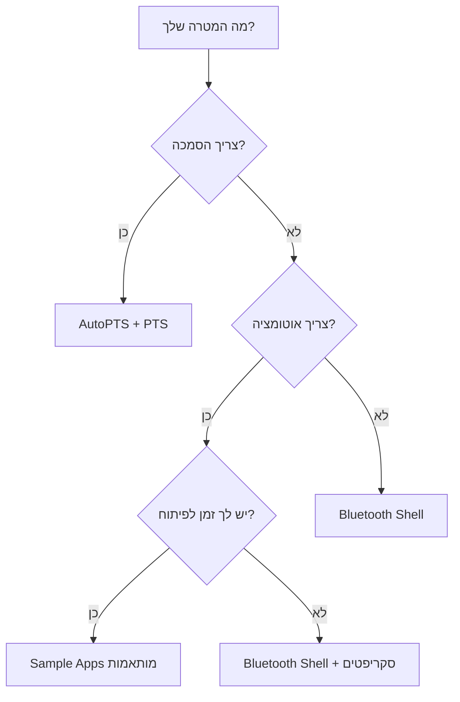

<div dir="rtl" style="text-align: right;">

# דוח מפורט: בדיקות Bluetooth עם מכשירים פיזיים ב-Zephyr

## תוכן עניינים
1. [מבוא והשוואה בין סימולציה לחומרה פיזית](#מבוא)
2. [גישה 1: AutoPTS - בדיקות אוטומטיות עם PTS](#autopts)
3. [גישה 2: Bluetooth Shell - בדיקות ידניות אינטראקטיביות](#shell)
4. [גישה 3: Sample Applications - בניית תרחישי בדיקה מותאמים אישית](#samples)
5. [פרוטוקול BTP - העברת פקודות למכשיר](#btp)
6. [הגדרה מעשית: צעד אחר צעד](#setup)
7. [סיכום והמלצות](#summary)

---

## מבוא והשוואה בין סימולציה לחומרה פיזית {#מבוא}

### מה BabbleSim עושה?
BabbleSim הוא סימולטור שמאפשר להריץ את ה-Bluetooth Stack של Zephyr כקובץ הרצה על המחשב, ללא צורך בחומרה פיזית. הוא מדמה את סביבת הרדיו ומאפשר לכמה "מכשירים" וירטואליים לתקשר זה עם זה.

### מה אתה מחפש?
אתה מעוניין לעשות את אותו הדבר – לבדוק תרחישי Bluetooth (חיבור Central/Peripheral, ניתוק, חיבור מחדש וכו') – אבל עם **מכשירים פיזיים אמיתיים** מחוברים למחשב.

### שלושת הגישות העיקריות

| גישה | מתאימה ל- | רמת אוטומציה | דרישות |
|------|-----------|--------------|---------|
| **AutoPTS** | הסמכה, בדיקות מקיפות | גבוהה מאוד | PTS Dongle, Windows, רישיון PTS |
| **Bluetooth Shell** | בדיקות ידניות, דיבוג | ידנית | 2 לוחות פיתוח |
| **Sample Apps** | בדיקות מותאמות אישית | ניתן לאוטומט | 2 לוחות פיתוח |

---

## גישה 1: AutoPTS - בדיקות אוטומטיות עם PTS {#autopts}

### מה זה AutoPTS?
AutoPTS הוא Framework אוטומציה שמאפשר להריץ באופן אוטומטי את בדיקות ה-PTS (Profile Tuning Suite) של Bluetooth SIG. במקום להריץ ידנית מאות בדיקות דרך ממשק גרפי, AutoPTS שולט על PTS דרך API ומריץ את הבדיקות באופן אוטומטי.

> [!IMPORTANT]
> **AutoPTS הצליח לאוטומט יותר מ-630 מקרי בדיקה** עבור Zephyr, מה שמצמצם את זמן הבדיקה מ-"אדם אחד - חודשיים" ל-15 שעות בלבד.

### ארכיטקטורה

```
┌─────────────────────────────────────────────────────────────┐
│                         Windows                              │
│  ┌──────────────┐     ┌──────────────┐     ┌──────────────┐ │
│  │ AutoPTS      │────▶│ PTS Software │────▶│ PTS Dongle   │ │
│  │ Server       │     │ (Bluetooth   │     │ (USB)        │ │
│  │ (Python)     │     │  SIG)        │     │              │ │
│  └──────────────┘     └──────────────┘     └──────────────┘ │
│         ▲                                                    │
└─────────│────────────────────────────────────────────────────┘
          │  XML-RPC (Network)
          │
┌─────────│────────────────────────────────────────────────────┐
│         ▼                Linux / macOS                       │
│  ┌──────────────┐     ┌──────────────┐     ┌──────────────┐ │
│  │ AutoPTS      │────▶│ BTP Protocol │────▶│ nRF52840     │ │
│  │ Client       │     │ (via UART)   │     │ (IUT)        │ │
│  │ (Python)     │     │              │     │              │ │
│  └──────────────┘     └──────────────┘     └──────────────┘ │
│                                                              │
└──────────────────────────────────────────────────────────────┘
```

**מקור:** [autopts-linux.rst](file:///Users/tzoharlary/zephyrproject/zephyr/doc/connectivity/bluetooth/autopts/autopts-linux.rst)

### מה נדרש?

1. **PTS Dongle** - התקן Bluetooth מיוחד מ-Bluetooth SIG
2. **תוכנת PTS 8** - מ-[bluetooth.org](https://www.bluetooth.org) (דורשת חברות)
3. **Windows** - להרצת ה-PTS Server (יכול להיות VM)
4. **לוח פיתוח** - למשל nRF52840DK

### התקנה והגדרה

#### שלב 1: בניית אפליקציית ה-Tester
```bash
cd ~/zephyrproject
west build -p auto -b nrf52840dk/nrf52840 zephyr/tests/bluetooth/tester/
west flash
```

#### שלב 2: התקנת AutoPTS
```bash
git clone https://github.com/intel/auto-pts.git
cd auto-pts
pip3 install --user wheel
pip3 install --user -r autoptsclient_requirements.txt
```

#### שלב 3: הפעלת Server (Windows)
```bash
python ./autoptsserver.py -S 65000
```

#### שלב 4: הפעלת Client (Linux)
```bash
python ./autoptsclient-zephyr.py zephyr-master ~/zephyrproject/build/zephyr/zephyr.elf \
    -t /dev/ttyACM0 -b nrf52 -l 192.168.2.1 -i 192.168.2.2
```

**מקורות:**
- [README](file:///Users/tzoharlary/zephyrproject/zephyr/tests/bluetooth/tester/README)
- [autopts-win10.rst](file:///Users/tzoharlary/zephyrproject/zephyr/doc/connectivity/bluetooth/autopts/autopts-win10.rst)

---

## גישה 2: Bluetooth Shell - בדיקות ידניות אינטראקטיביות {#shell}

### מה זה?
Bluetooth Shell הוא אפליקציה מובנית ב-Zephyr שמספקת ממשק פקודות (CLI) לשליטה מלאה ב-Bluetooth Stack. זוהי **הדרך הפשוטה והמהירה ביותר** לבדוק תרחישי Bluetooth עם מכשירים פיזיים.

### דוגמה: חיבור Central ←→ Peripheral

#### מכשיר A (Peripheral):
```console
uart:~$ bt init
Bluetooth initialized

uart:~$ bt advertise on
Advertising started
```

#### מכשיר B (Central):
```console
uart:~$ bt init
Bluetooth initialized

uart:~$ bt scan on
[DEVICE]: EB:BF:36:26:42:09 (random), AD evt type 0, RSSI -34

uart:~$ bt scan off
Scan successfully stopped

uart:~$ bt connect EB:BF:36:26:42:09 random
Connection pending
Connected: EB:BF:36:26:42:09 (random)
```

### פקודות שימושיות

| פקודה | תיאור |
|-------|-------|
| `bt init` | אתחול Bluetooth Stack |
| `bt advertise on` | התחלת פרסום (Peripheral) |
| `bt scan on` | התחלת סריקה (Central) |
| `bt connect <addr> <type>` | חיבור למכשיר |
| `bt disconnect` | ניתוק |
| `bt security <level>` | הפעלת אבטחה (1-4) |
| `gatt discover` | גילוי שירותים |
| `gatt subscribe <handle>` | הרשמה להתראות |

### בניית ה-Shell
```bash
cd ~/zephyrproject
west build -b nrf52840dk/nrf52840 zephyr/tests/bluetooth/shell/
west flash
```

לאחר מכן, התחבר באמצעות Serial Terminal (למשל `minicom`, `screen`, או PuTTY) ל-COM Port המתאים.

**מקור:** [bluetooth-shell.rst](file:///Users/tzoharlary/zephyrproject/zephyr/doc/connectivity/bluetooth/bluetooth-shell.rst)

---

## גישה 3: Sample Applications - בניית תרחישי בדיקה מותאמים אישית {#samples}

### הרעיון
Zephyr מספקת זוגות של אפליקציות דוגמה (Central + Peripheral) שניתן להריץ על שני מכשירים נפרדים. הם מתחברים אוטומטית ומבצעים פעולות מוגדרות מראש.

### דוגמאות זמינות

| Central | Peripheral | מה בודק |
|---------|------------|---------|
| `central_hr` | `peripheral_hr` | Heart Rate Profile |
| `central_ht` | `peripheral_ht` | Health Thermometer |
| `central` | `peripheral` | חיבור בסיסי |
| `mtu_update/central` | `mtu_update/peripheral` | עדכון MTU |

### דוגמה: MTU Update

#### בניית ה-Peripheral (מכשיר 1):
```bash
west build -b nrf52840dk/nrf52840 zephyr/samples/bluetooth/mtu_update/peripheral
west flash
```

#### בניית ה-Central (מכשיר 2):
```bash
west build -b nrf52840dk/nrf52840 zephyr/samples/bluetooth/mtu_update/central
west flash
```

כאשר שני המכשירים קרובים מספיק, ה-Central יסרוק, ימצא את ה-Peripheral, יתחבר, יבצע MTU Exchange, ישלח Notification גדול, ואז ינתק.

**פלט צפוי (Central):**
```console
*** Booting Zephyr OS ***
Bluetooth initialized
Scanning successfully started
Device found: EB:BF:36:26:42:09 (random) (RSSI -34)
Connected: EB:BF:36:26:42:09 (random)
mtu_exchange: Current MTU = 23
mtu_exchange: Exchange MTU...
mtu_exchange_cb: MTU exchange successful (247)
[SUBSCRIBED]
[NOTIFICATION] data 0x20004b73 length 100
[UNSUBSCRIBED]
```

**מקור:** [mtu_update/README.rst](file:///Users/tzoharlary/zephyrproject/zephyr/samples/bluetooth/mtu_update/README.rst)

---

## פרוטוקול BTP - העברת פקודות למכשיר {#btp}

### מה זה BTP?
**Bluetooth Test Protocol (BTP)** הוא פרוטוקול בינארי שמשמש לשליטה ב-Bluetooth Stack מרחוק. הוא הפרוטוקול ש-AutoPTS משתמש בו כדי לתקשר עם המכשיר הנבדק (IUT - Implementation Under Test).

### מבנה הפקודה

```
┌─────────┬─────────┬─────────┬─────────┬──────────┐
│ Service │ Opcode  │ Index   │ Length  │ Data     │
│ (1 byte)│ (1 byte)│ (1 byte)│ (2 bytes)│ (N bytes)│
└─────────┴─────────┴─────────┴─────────┴──────────┘
```

### שירותים נתמכים

| Service ID | שם | תיאור |
|------------|-----|-------|
| 0 | CORE | פעולות בסיסיות |
| 1 | GAP | חיבור, סריקה, פרסום |
| 2 | GATT | שירותים ומאפיינים |
| 3 | L2CAP | ערוצי נתונים |
| 4 | MESH | Bluetooth Mesh |

### דוגמה: פקודת חיבור (GAP_CONNECT)

```c
#define BTP_GAP_CONNECT  0x0e
struct btp_gap_connect_cmd {
    bt_addr_le_t address;    // כתובת היעד
    uint8_t own_addr_type;   // סוג הכתובת שלנו
} __packed;
```

**מקור:** [btp_gap.h](file:///Users/tzoharlary/zephyrproject/zephyr/tests/bluetooth/tester/src/btp/btp_gap.h)

---

## הגדרה מעשית: צעד אחר צעד {#setup}

### תרחיש: בדיקת חיבור וניתוק עם שני מכשירים פיזיים

#### דרישות
- 2 × לוחות פיתוח (למשל nRF52840DK)
- 2 × כבלי USB
- מחשב עם Zephyr מותקן

### אפשרות A: שימוש ב-Bluetooth Shell (ידני)

#### 1. בניית ה-Shell עבור שני הלוחות
```bash
# בנה ל-Board 1
west build -b nrf52840dk/nrf52840 zephyr/tests/bluetooth/shell/ -d build_board1
west flash -d build_board1 --dev-id <SERIAL_1>

# בנה ל-Board 2
west build -b nrf52840dk/nrf52840 zephyr/tests/bluetooth/shell/ -d build_board2
west flash -d build_board2 --dev-id <SERIAL_2>
```

> [!TIP]
> מצא את ה-Serial ID של כל לוח עם הפקודה `nrfjprog --ids`

#### 2. התחברות ל-Serial Ports
```bash
# Terminal 1 (Board 1):
minicom -D /dev/ttyACM0

# Terminal 2 (Board 2):
minicom -D /dev/ttyACM1
```

#### 3. הרצת תרחיש הבדיקה

**Board 1 (Peripheral):**
```console
uart:~$ bt init
uart:~$ bt advertise on
```

**Board 2 (Central):**
```console
uart:~$ bt init
uart:~$ bt scan on
# רשום את הכתובת שמופיעה
uart:~$ bt scan off
uart:~$ bt connect <ADDRESS> random
# המתן לחיבור
uart:~$ bt disconnect
# וחזור שוב:
uart:~$ bt connect <ADDRESS> random
```

### אפשרות B: שימוש ב-Sample Applications (אוטומטי)

#### 1. בנה Peripheral:
```bash
west build -b nrf52840dk/nrf52840 zephyr/samples/bluetooth/peripheral -d build_peripheral
west flash -d build_peripheral --dev-id <SERIAL_1>
```

#### 2. בנה Central:
```bash
west build -b nrf52840dk/nrf52840 zephyr/samples/bluetooth/central -d build_central
west flash -d build_central --dev-id <SERIAL_2>
```

#### 3. צפה בפלט
המכשירים יתחברו אוטומטית כאשר הם קרובים מספיק.

### אפשרות C: שימוש ב-AutoPTS (אוטומטי + מקיף)

ראה את [מדריך ההתקנה של AutoPTS](#autopts) למעלה.

---

## סיכום והמלצות {#summary}

### מתי להשתמש בכל גישה?



### המלצה עבורך

בהתבסס על מה שתיארת (בדיקת Central/Peripheral, חיבור וניתוק), אני ממליץ:

> [!IMPORTANT]
> **התחל עם Bluetooth Shell** - זו הדרך הפשוטה והמהירה ביותר להתחיל. אתה יכול לכתוב סקריפטים שישלחו פקודות דרך Serial ולאוטומט את הבדיקות בהמשך.

### סיכום טבלאי

| קריטריון | BabbleSim | AutoPTS | Shell | Samples |
|----------|-----------|---------|-------|---------|
| צריך חומרה | ❌ | ✅ | ✅ | ✅ |
| אוטומטי | ✅ | ✅ | ❌ | ✅ |
| קל להתקנה | ✅ | ❌ | ✅ | ✅ |
| מתאים להסמכה | ❌ | ✅ | ❌ | ❌ |
| גמישות | בינונית | נמוכה | גבוהה | גבוהה |

### קישורים למקורות

- [Bluetooth Tester README](file:///Users/tzoharlary/zephyrproject/zephyr/tests/bluetooth/tester/README)
- [Bluetooth Shell Documentation](file:///Users/tzoharlary/zephyrproject/zephyr/doc/connectivity/bluetooth/bluetooth-shell.rst)
- [AutoPTS Linux Guide](file:///Users/tzoharlary/zephyrproject/zephyr/doc/connectivity/bluetooth/autopts/autopts-linux.rst)
- [AutoPTS Windows Guide](file:///Users/tzoharlary/zephyrproject/zephyr/doc/connectivity/bluetooth/autopts/autopts-win10.rst)
- [BTP Protocol Header](file:///Users/tzoharlary/zephyrproject/zephyr/tests/bluetooth/tester/src/btp/btp_gap.h)
- [MTU Update Sample](file:///Users/tzoharlary/zephyrproject/zephyr/samples/bluetooth/mtu_update/README.rst)

</div>
