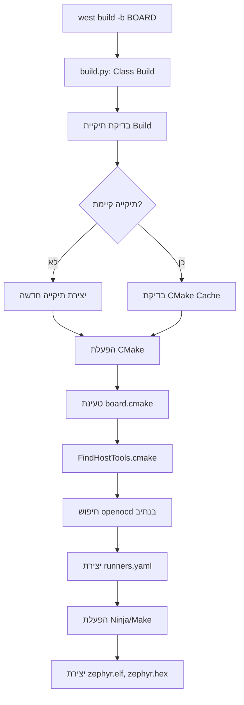
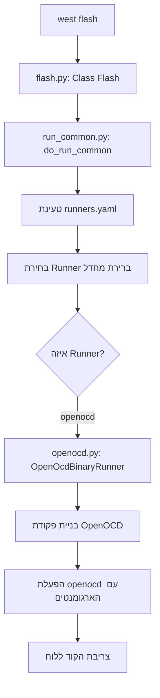
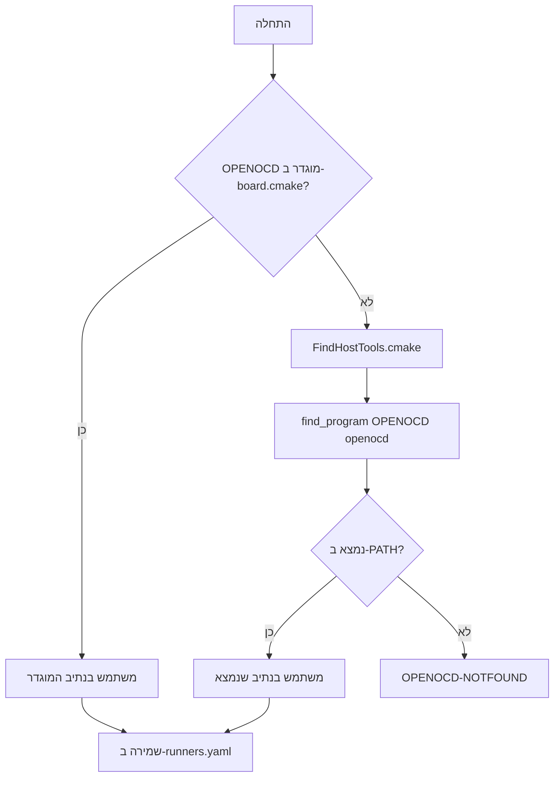

<div dir="rtl" style="text-align: right;">

# דוח מפורט: מנגנון West Build ו-West Flash עם OpenOCD

## תוכן עניינים
1. [סקירה כללית](#סקירה-כללית)
2. [פקודת West Build](#פקודת-west-build)
3. [פקודת West Flash](#פקודת-west-flash)
4. [כיצד West יודע איפה OpenOCD נמצא](#כיצד-west-יודע-איפה-openocd-נמצא)
5. [קבצי הקונפיגורציה המרכזיים](#קבצי-הקונפיגורציה-המרכזיים)
6. [סיכום זרימת התהליך](#סיכום-זרימת-התהליך)

---

## סקירה כללית

מערכת ה-**West** של Zephyr היא כלי Meta-tool שמספק ממשק מאוחד לפעולות שונות על פרויקט Zephyr, כולל:
- **`west build`** - קומפילציה של אפליקציה
- **`west flash`** - צריבת הקוד ללוח
- **`west debug`** - דיבאגינג

המערכת משתמשת ב-**Runners** - מודולי Python שמפעילים כלים חיצוניים כמו OpenOCD, J-Link, PyOCD ועוד.

---

## פקודת West Build

### מה קורה בזמן `west build`?

פקודת `west build` היא wrapper נוח מעל CMake. הנה הזרימה המלאה:



### קובץ build.py - נקודת הכניסה

הקובץ [build.py](file:///Users/tzoharlary/zephyrproject/zephyr/scripts/west_commands/build.py) מגדיר את המחלקה `Build`:

```python
class Build(Forceable):
    def __init__(self):
        super(Build, self).__init__(
            'build',
            'compile a Zephyr application',
            BUILD_DESCRIPTION,
            accepts_unknown_args=True)
```

### תהליך ה-Build המפורט:

1. **פרסור ארגומנטים** - הפקודה מקבלת את הלוח (`-b`), תיקיית Build (`-d`), ועוד.

2. **הכנת תיקיית Build** - נוצרת תיקייה אם לא קיימת.

3. **הפעלת CMake** - נוצר build system:
   ```python
   def _run_cmake(self, board, origin, cmake_opts):
       cmake_opts = ['-DBOARD={}'.format(board)]
       run_cmake(final_cmake_args, dry_run=self.args.dry_run)
   ```

4. **טעינת board.cmake** - הקובץ [kernel.cmake](file:///Users/tzoharlary/zephyrproject/zephyr/cmake/modules/kernel.cmake) מכיל:
   ```cmake
   include(${BOARD_DIR}/board.cmake OPTIONAL)
   ```
   
   זה טוען את קובץ הלוח הספציפי, לדוגמה עבור לוח TI CC2340R5:
   
   [board.cmake](file:///Users/tzoharlary/zephyrproject/zephyr/boards/ti/lp_em_cc2340r5/board.cmake):
   ```cmake
   board_runner_args(openocd --cmd-pre-init "source [find board/ti_lp_em_cc2340r5.cfg]")
   set(OPENOCD_BASE $ENV{}TI_OPENOCD_INSTALL_DIR/openocd/bin)
   set(OPENOCD ${OPENOCD_BASE}/bin/openocd)
   set(OPENOCD_DEFAULT_PATH ${OPENOCD_BASE}/share/openocd/scripts)
   include(${ZEPHYR_BASE}/boards/common/openocd.board.cmake)
   ```

5. **חיפוש כלי Host** - הקובץ [FindHostTools.cmake](file:///Users/tzoharlary/zephyrproject/zephyr/cmake/modules/FindHostTools.cmake) מחפש את OpenOCD:
   ```cmake
   # openocd is an optional dependency
   find_program(OPENOCD openocd)
   ```

6. **יצירת runners.yaml** - בסוף תהליך ה-CMake נוצר קובץ [runners.yaml](file:///Users/tzoharlary/zephyrproject/zephyr/build/zephyr/runners.yaml) המכיל את כל הגדרות ה-Runners.

---

## פקודת West Flash

### מה קורה בזמן `west flash`?



### קובץ flash.py

הקובץ [flash.py](file:///Users/tzoharlary/zephyrproject/zephyr/scripts/west_commands/flash.py):

```python
class Flash(WestCommand):
    def __init__(self):
        super(Flash, self).__init__(
            'flash',
            'flash and run a binary on a board',
            "Permanently reprogram a board's flash with a new binary.",
            accepts_unknown_args=True)
        self.runner_key = 'flash-runner'  # in runners.yaml

    def do_run(self, my_args, runner_args):
        build_dir = get_build_dir(my_args)
        do_run_common(self, my_args, runner_args, domain_file=domains_file)
```

### קובץ run_common.py - הליבה של הרצת Runners

הקובץ [run_common.py](file:///Users/tzoharlary/zephyrproject/zephyr/scripts/west_commands/run_common.py) מכיל את הלוגיקה המרכזית:

1. **טעינת runners.yaml**:
   ```python
   def load_runners_yaml(path):
       with open(path, 'r') as f:
           content = yaml.safe_load(f.read())
       return content
   ```

2. **בחירת Runner**:
   ```python
   def use_runner_cls(command, board, args, runners_yaml, cache):
       runner = args.runner or runners_yaml.get(command.runner_key)
       runner_cls = get_runner_cls(runner)
       return runner_cls
   ```

3. **קריאת הגדרות OpenOCD מ-runners.yaml**:
   ```python
   def get_runner_config(build_dir, yaml_path, runners_yaml, args=None):
       return RunnerConfig(
           build_dir,
           yaml_config['board_dir'],
           # ...
           config('openocd'),
           config('openocd_search', [])
       )
   ```

---

## כיצד West יודע איפה OpenOCD נמצא

### שרשרת החיפוש של OpenOCD:



### מקור 1: הגדרה ספציפית ב-board.cmake

בקובץ [board.cmake](file:///Users/tzoharlary/zephyrproject/zephyr/boards/ti/lp_em_cc2340r5/board.cmake) של הלוח:

```cmake
set(OPENOCD_BASE $ENV{}TI_OPENOCD_INSTALL_DIR/openocd/bin)
set(OPENOCD ${OPENOCD_BASE}/bin/openocd)
set(OPENOCD_DEFAULT_PATH ${OPENOCD_BASE}/share/openocd/scripts)
```

> [!IMPORTANT]
> הקובץ `board.cmake` משתמש במשתנה סביבה `TI_OPENOCD_INSTALL_DIR` כדי לקבוע את מיקום OpenOCD עבור לוחות TI.

### מקור 2: חיפוש אוטומטי ב-PATH

אם לא הוגדר במפורש, [FindHostTools.cmake](file:///Users/tzoharlary/zephyrproject/zephyr/cmake/modules/FindHostTools.cmake) מחפש:

```cmake
find_program(OPENOCD openocd)
```

פקודה זו מחפשת את `openocd` ב:
1. תיקיות ב-`PATH`
2. נתיבים סטנדרטיים של המערכת

### מקור 3: CMake Configure Log

מתוך [CMakeConfigureLog.yaml](file:///Users/tzoharlary/zephyrproject/zephyr/build/CMakeFiles/CMakeConfigureLog.yaml), ניתן לראות את תהליך החיפוש:

```yaml
# נתיבים שנבדקו:
- "/Users/tzoharlary/zephyr-sdk-0.16.8/sysroots/x86_64-pokysdk-linux/usr/bin/openocd"
- "/Users/tzoharlary/zephyrproject/.venv/bin/openocd"
# הנתיב שנמצא:
found: "/Users/tzoharlary/ti/ti-openocd-current/bin/openocd"
```

### שמירה ב-runners.yaml

לאחר שנמצא הנתיב, הוא נשמר ב-[runners.yaml](file:///Users/tzoharlary/zephyrproject/zephyr/build/zephyr/runners.yaml):

```yaml
config:
  openocd: TI_OPENOCD_INSTALL_DIR/openocd/bin/bin/openocd
  openocd_search:
    - TI_OPENOCD_INSTALL_DIR/openocd/bin/share/openocd/scripts

args:
  openocd:
    - --cmd-load
    - flash write_image erase
    - --cmd-verify
    - verify_image
    - --cmd-pre-init
    - source [find board/ti_lp_em_cc2340r5.cfg]
```

---

## קבצי הקונפיגורציה המרכזיים

### 1. `.west/config` - קונפיגורציית West

[.west/config](file:///Users/tzoharlary/zephyrproject/.west/config):
```ini
[manifest]
path = zephyr
file = west.yml

[zephyr]
base = zephyr
```

### 2. `west.yml` - מניפסט הפרויקט

[west.yml](file:///Users/tzoharlary/zephyrproject/zephyr/west.yml) מגדיר את פקודות West המורחבות:
```yaml
self:
  path: zephyr
  west-commands: scripts/west-commands.yml
```

### 3. `west-commands.yml` - רישום פקודות West

[west-commands.yml](file:///Users/tzoharlary/zephyrproject/zephyr/scripts/west-commands.yml):
```yaml
west-commands:
  - file: scripts/west_commands/build.py
    commands:
      - name: build
        class: Build
        help: compile a Zephyr application
  - file: scripts/west_commands/flash.py
    commands:
      - name: flash
        class: Flash
        help: flash and run a binary on a board
```

### 4. `openocd.board.cmake` - קונפיגורציה משותפת ל-OpenOCD

[openocd.board.cmake](file:///Users/tzoharlary/zephyrproject/zephyr/boards/common/openocd.board.cmake):
```cmake
board_set_flasher_ifnset(openocd)
board_set_debugger_ifnset(openocd)

set(OPENOCD_CMD_LOAD_DEFAULT "${OPENOCD_FLASH}")
set(OPENOCD_CMD_VERIFY_DEFAULT "verify_image")

board_finalize_runner_args(openocd
  --cmd-load "${OPENOCD_CMD_LOAD_DEFAULT}"
  --cmd-verify "${OPENOCD_CMD_VERIFY_DEFAULT}"
)
```

### 5. `openocd.py` - מימוש ה-Runner של OpenOCD

[openocd.py](file:///Users/tzoharlary/zephyrproject/zephyr/scripts/west_commands/runners/openocd.py):

```python
class OpenOcdBinaryRunner(ZephyrBinaryRunner):
    '''Runner front-end for openocd.'''

    def __init__(self, cfg, ...):
        # בניית פקודת openocd
        self.openocd_cmd = [cfg.openocd or 'openocd'] + search_args
    
    def do_flash(self, **kwargs):
        hex_name = Path(self.cfg.hex_file).as_posix()
        cmd = (self.openocd_cmd + self.serial + self.cfg_cmd +
               pre_init_cmd + self.init_arg + self.targets_arg +
               pre_load_cmd + load_image +
               verify_image +
               post_verify_cmd +
               ['-c', 'reset run',
                '-c', 'shutdown'])
        self.check_call(cmd)
```

---

## סיכום זרימת התהליך

### West Build - תרשים זרימה מלא

```
┌────────────────────────────────────────────────────────────────────┐
│                           WEST BUILD                                │
├────────────────────────────────────────────────────────────────────┤
│                                                                     │
│  1. west build -b lp_em_cc2340r5                                   │
│         │                                                          │
│         ▼                                                          │
│  2. build.py → _run_cmake()                                        │
│         │                                                          │
│         ▼                                                          │
│  3. CMake מפעיל את kernel.cmake                                    │
│         │                                                          │
│         ▼                                                          │
│  4. kernel.cmake → include(${BOARD_DIR}/board.cmake)               │
│         │                                                          │
│         ▼                                                          │
│  5. board.cmake מגדיר:                                             │
│     • OPENOCD = TI_OPENOCD_INSTALL_DIR/openocd/bin/bin/openocd    │
│     • OPENOCD_DEFAULT_PATH = .../share/openocd/scripts             │
│     • board_runner_args(openocd ...)                               │
│         │                                                          │
│         ▼                                                          │
│  6. FindHostTools.cmake → find_program(OPENOCD openocd)            │
│         │                                                          │
│         ▼                                                          │
│  7. flash/CMakeLists.txt → create_runners_yaml()                   │
│         │                                                          │
│         ▼                                                          │
│  8. נוצר build/zephyr/runners.yaml עם כל ההגדרות                   │
│         │                                                          │
│         ▼                                                          │
│  9. Ninja בונה את zephyr.elf, zephyr.hex                           │
│                                                                     │
└────────────────────────────────────────────────────────────────────┘
```

### West Flash - תרשים זרימה מלא

```
┌────────────────────────────────────────────────────────────────────┐
│                           WEST FLASH                                │
├────────────────────────────────────────────────────────────────────┤
│                                                                     │
│  1. west flash                                                      │
│         │                                                          │
│         ▼                                                          │
│  2. flash.py → do_run()                                            │
│         │                                                          │
│         ▼                                                          │
│  3. run_common.py → do_run_common()                                │
│         │                                                          │
│         ▼                                                          │
│  4. load_runners_yaml() - טעינת build/zephyr/runners.yaml          │
│         │                                                          │
│         ▼                                                          │
│  5. קריאת flash-runner: openocd                                    │
│         │                                                          │
│         ▼                                                          │
│  6. use_runner_cls() → OpenOcdBinaryRunner                         │
│         │                                                          │
│         ▼                                                          │
│  7. get_runner_config() - קריאת:                                   │
│     • openocd path                                                 │
│     • openocd_search paths                                         │
│     • hex_file, elf_file                                           │
│         │                                                          │
│         ▼                                                          │
│  8. openocd.py → do_flash()                                        │
│         │                                                          │
│         ▼                                                          │
│  9. בניית פקודת OpenOCD:                                           │
│     openocd -s <search_paths> -f <config> -c init -c targets       │
│             -c "reset init" -c "flash write_image erase zephyr.hex"│
│             -c "reset run" -c shutdown                             │
│         │                                                          │
│         ▼                                                          │
│  10. הרצת OpenOCD וצריבת הקוד                                      │
│                                                                     │
└────────────────────────────────────────────────────────────────────┘
```

---

## סיכום

| שלב | West Build | West Flash |
|-----|------------|------------|
| **נקודת כניסה** | `build.py` | `flash.py` |
| **איפה נקבע OpenOCD** | `board.cmake` + `FindHostTools.cmake` | נקרא מ-`runners.yaml` |
| **קובץ פלט** | `runners.yaml`, `zephyr.elf`, `zephyr.hex` | צריבה ללוח |
| **מקור נתיב OpenOCD** | 1. משתנה סביבה 2. board.cmake 3. PATH | `runners.yaml` שנוצר ב-build |

> [!TIP]
> לצפייה בהגדרות ה-Runner שלך, הרץ:
> ```bash
> west flash --context
> ```

</div>
