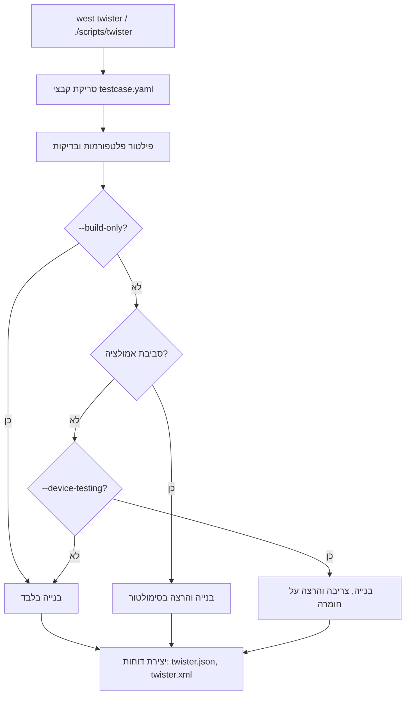

<div dir="rtl" style="text-align: right;">

# דוח: ביצוע Build באמצעות West Twister ב-Zephyr

דוח מפורט המסביר כיצד להשתמש ב-`west twister` לביצוע build ובדיקות בפרויקט Zephyr, בהתבסס על המקורות הרשמיים והקוד בפרויקט המקומי.

---

## סקירה כללית

**Twister** הוא כלי בדיקות אוטומטי (Test Runner) של פרויקט Zephyr. הוא סורק את מאגר ה-Git לאיתור אפליקציות בדיקה ומנסה להריץ אותן. ברירת המחדל היא לבנות כל אפליקציית בדיקה על לוחות המסומנים כברירת מחדל בקובצי ההגדרה של הלוח.

> [!NOTE]
> Twister נתמך במלואו רק בסביבת **Linux**. ב-Windows וב-macOS ניתן רק לבנות (build) ולא להריץ בדיקות.

---

## דרכים להפעלת Twister

ישנן שתי דרכים עיקריות להפעלת Twister:

### 1. דרך West (המומלצת)

```bash
west twister [options]
```

### 2. דרך הסקריפט ישירות

```bash
# Linux/macOS
./scripts/twister [options]

# Windows
python .\scripts\twister [options]
```

> [!TIP]
> לפני הפעלת Twister, יש לוודא שמשתנה הסביבה `ZEPHYR_BASE` מוגדר. ניתן לעשות זאת באמצעות:
> ```bash
> source zephyr-env.sh
> ```

---

## פקודות Build & Test בסיסיות

### בנייה בלבד (Build Only)

```bash
# בניית בדיקה ספציפית על פלטפורמה ספציפית
west twister -p <platform> -T <test_path> --build-only

# דוגמה מהפרויקט הנוכחי:
west twister -p lp_em_cc2745r10_q1/cc2745r10_q1 -T tests/bluetooth/tester --build-only
```

### בנייה והרצה

```bash
# בנייה והרצה על סימולטור/אמולטור
west twister -p native_sim -T tests/kernel

# בנייה והרצה על כל הפלטפורמות
west twister --all --enable-slow
```

### הרצה על חומרה אמיתית

```bash
west twister --device-testing --device-serial /dev/ttyACM0 \
    --device-serial-baud 115200 -p <platform> -T <test_path>
```

---

## אפשרויות שורת פקודה חשובות

| אפשרות | תיאור |
|--------|-------|
| `-p, --platform <name>` | פילטור לפי פלטפורמה ספציפית |
| `-T, --testsuite-root <path>` | נתיב לתיקיית הבדיקות |
| `-b, --build-only` | רק בנייה, ללא הרצה |
| `--device-testing` | בדיקה על התקן פיזי |
| `--device-serial <port>` | פורט סריאלי להתקן |
| `--west-flash` | שימוש ב-`west flash` לצריבה |
| `-v, --verbose` | פלט מפורט |
| `--all` | בנייה לכל הלוחות הזמינים |
| `--enable-slow` | הפעלת בדיקות איטיות |
| `-s, --test <scenario>` | הרצת תרחיש בדיקה ספציפי |
| `--cmake-only` | רק הרצת CMake, ללא בנייה |
| `-N, --ninja` | שימוש ב-Ninja (ברירת מחדל) |
| `-O, --outdir <dir>` | תיקיית פלט |

---

## ממצאים מהפרויקט המקומי

### מבנה ה-Twister בפרויקט

```
zephyr/scripts/
├── twister                      # סקריפט ה-Twister הראשי
├── west-commands.yml            # הגדרת פקודות west (כולל twister)
└── west_commands/
    └── twister_cmd.py           # מימוש פקודת west twister
```

### קובץ `testcase.yaml` לבדיקות Bluetooth

נמצא ב: `tests/bluetooth/tester/testcase.yaml`

```yaml
tests:
  bluetooth.general.tester:
    build_only: true
    platform_allow:
      - qemu_x86
      - native_posix
      - native_sim
      - nrf52840dk/nrf52840
    tags: bluetooth
    harness: bluetooth
```

> [!IMPORTANT]
> שים לב שבדיקת `bluetooth.general.tester` מוגדרת כ-`build_only: true`, כלומר היא תבנה בלבד ולא תורץ אוטומטית.

### תמיכה בלוח TI CC2745R10-Q1

נמצא ב: `boards/ti/lp_em_cc2745r10_q1/`

הגדרת הלוח: [lp_em_cc2745r10_q1_cc2745r10_q1.yaml](file:///Users/tzoharlary/zephyrproject/zephyr/boards/ti/lp_em_cc2745r10_q1/lp_em_cc2745r10_q1_cc2745r10_q1.yaml)

```yaml
identifier: lp_em_cc2745r10_q1/cc2745r10_q1
name: TI SimpleLink CC2745R10_Q1 LaunchPad
type: mcu
arch: arm
ram: 162
flash: 1024
toolchain:
  - zephyr
  - gnuarmemb
  - xtools
supported:
  - gpio
vendor: ti
```

הגדרת Runners: [board.cmake](file:///Users/tzoharlary/zephyrproject/zephyr/boards/ti/lp_em_cc2745r10_q1/board.cmake)

```cmake
board_runner_args(jlink "--device=CC2745R10-Q1")
board_runner_args(openocd --cmd-pre-init "source [find board/ti_lp_em_cc2745r10.cfg]")
```

---

## דוגמאות פקודות עבור הפרויקט הנוכחי

### 1. בניית בדיקות Bluetooth עבור CC2745R10-Q1

```bash
west twister -p lp_em_cc2745r10_q1/cc2745r10_q1 \
    -T tests/bluetooth/tester \
    --build-only
```

### 2. בניית בדיקה ספציפית

```bash
west twister -p lp_em_cc2745r10_q1/cc2745r10_q1 \
    -s tests/bluetooth/tester/bluetooth.general.tester \
    --build-only
```

### 3. בנייה על סימולטור (native_sim)

```bash
west twister -p native_sim -T tests/bluetooth/tester
```

### 4. בדיקה על חומרה עם OpenOCD

```bash
west twister --device-testing \
    --device-serial /dev/ttyACM0 \
    --west-flash \
    -p lp_em_cc2745r10_q1/cc2745r10_q1 \
    -T tests/bluetooth/tester
```

### 5. הצגת כל הבדיקות הזמינות

```bash
west twister --list-tests -T tests/bluetooth/tester
```

---

## תהליך העבודה של Twister



---

## מבנה קבצי הבדיקה (testcase.yaml)

קובץ `testcase.yaml` מגדיר תרחישי בדיקה (Test Scenarios). המבנה הבסיסי:

```yaml
tests:
  <test.scenario.name>:
    build_only: <true|false>        # האם לבנות בלבד
    platform_allow:                  # רשימת פלטפורמות מותרות
      - platform1
      - platform2
    platform_exclude:                # רשימת פלטפורמות מוחרגות
      - platform3
    tags: <tag1> <tag2>              # תגיות לסינון
    harness: <harness_type>          # סוג harness (bluetooth, console, etc.)
    extra_args: <cmake_args>         # ארגומנטים נוספים ל-CMake
    extra_configs:                   # הגדרות Kconfig נוספות
      - CONFIG_OPTION=value
    timeout: <seconds>               # זמן מקסימלי להרצה
    min_ram: <KB>                    # דרישת RAM מינימלית
    min_flash: <KB>                  # דרישת Flash מינימלית
```

---

## דוחות ופלטים

Twister מייצר את הקבצים הבאים בתיקיית הפלט (ברירת מחדל: `twister-out`):

| קובץ | תיאור |
|------|-------|
| `twister.json` | דוח JSON מלא עם כל תוצאות הבדיקות |
| `twister.xml` | דוח בפורמט JUnit (עבור CI) |
| `testplan.json` | תוכנית הבדיקות שנוצרה |

---

## סיכום

> [!TIP]
> **פקודה מומלצת לבניית בדיקות על הלוח CC2745R10-Q1:**
> ```bash
> west twister -p lp_em_cc2745r10_q1/cc2745r10_q1 \
>     -T tests/bluetooth/tester \
>     --build-only -v
> ```

| פריט | ערך/נתיב |
|------|----------|
| **שם הפלטפורמה** | `lp_em_cc2745r10_q1/cc2745r10_q1` |
| **נתיב בדיקות Bluetooth** | `tests/bluetooth/tester` |
| **מזהה הלוח ל-J-Link** | `CC2745R10-Q1` |
| **קובץ OpenOCD** | `ti_lp_em_cc2745r10.cfg` |

---

## מקורות

1. [Zephyr Official Documentation - Test Runner (Twister)](https://docs.zephyrproject.org/latest/develop/test/twister.html)
2. [Guidelines - Running twister](file:///Users/tzoharlary/zephyrproject/zephyr/doc/contribute/guidelines.rst#L673-L689)
3. [west-commands.yml](file:///Users/tzoharlary/zephyrproject/zephyr/scripts/west-commands.yml)
4. [twister_cmd.py](file:///Users/tzoharlary/zephyrproject/zephyr/scripts/west_commands/twister_cmd.py)
5. [testcase.yaml](file:///Users/tzoharlary/zephyrproject/zephyr/tests/bluetooth/tester/testcase.yaml)
6. [board.cmake for CC2745R10-Q1](file:///Users/tzoharlary/zephyrproject/zephyr/boards/ti/lp_em_cc2745r10_q1/board.cmake)

</div>
